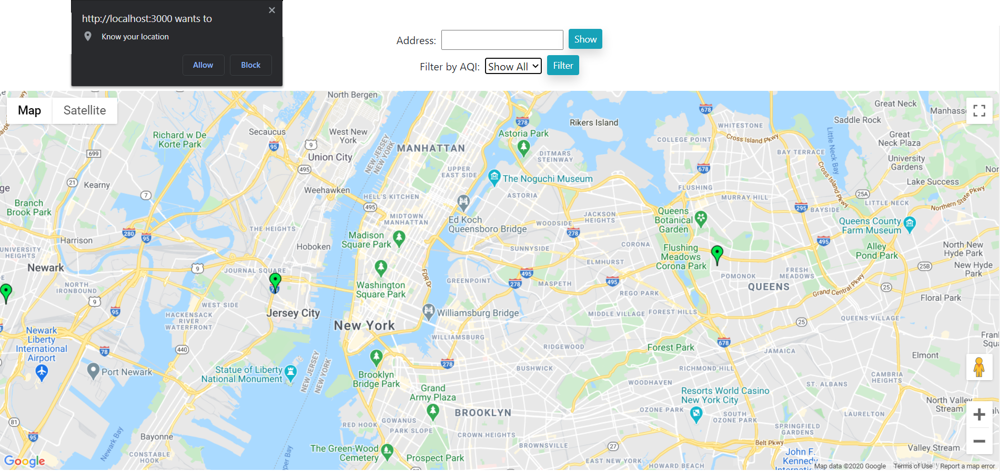
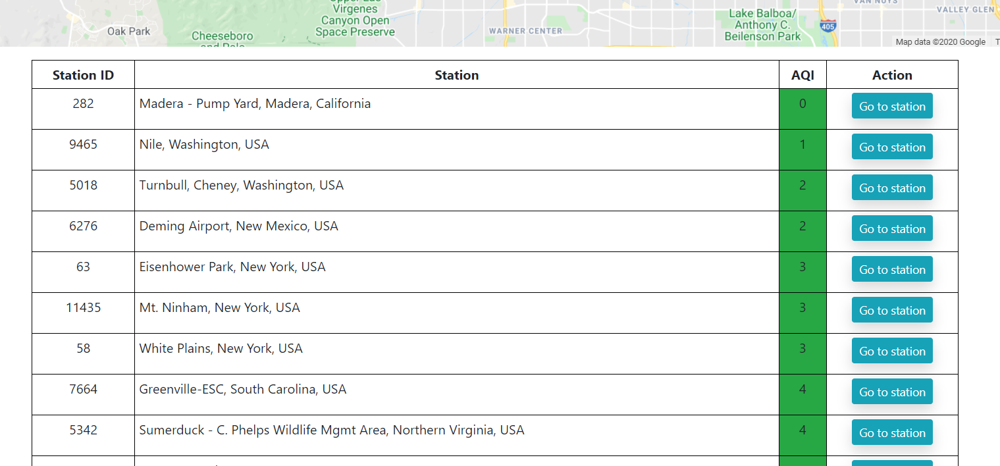
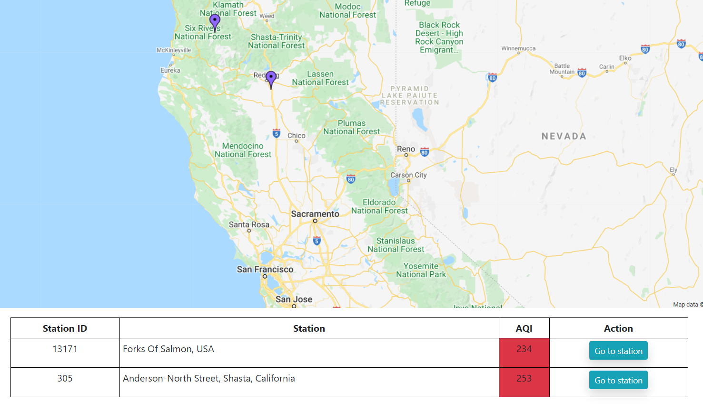
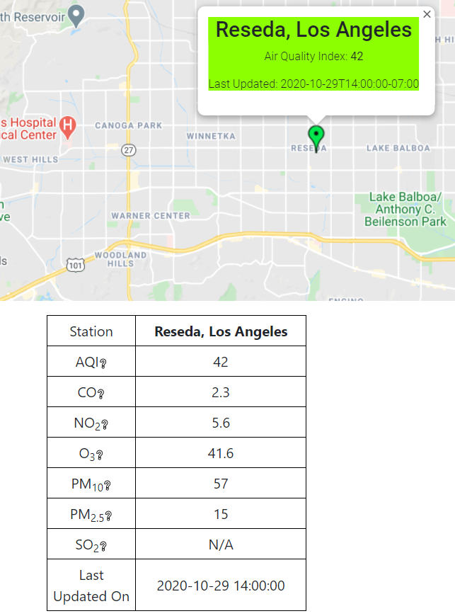

# AQI Maps

AQI Maps is a MERN-based project utilizing [World Air Quality Index API][1] (WAQI) and [Google Maps API][2]. Users can access air quality index(AQI) throughout the U.S. stations with highly intuitive interfaces.

## Setup
AQI Maps require following softwares to launch:
- `Node.js`
- `MongoDB`

When creating your Google API key, make sure to include `Maps JavaScript API` and `Geocoding API`.
In the `client` directory, create a file called `.env` which will contain your Google Maps API key.
Include the following line within that file:
```sh
REACT_APP_API_KEY = {{ YOUR_GOOGLE_MAPS_API_KEY }}
```
where `{{ YOUR_GOOGLE_MAPS_API_KEY }}` is to be replaced accordingly.

After the above steps, open two separate terminals and run the following commands in each.
In the first terminal:
```sh
cd client
npm i   #This will install all necessary dependencies for the frontend
npm start
```
In the second terminal:
```sh
cd server
npm i   #This will install all necessary dependencies for the backend
nodemon server.js
```

You should be able to see the project at `localhost:3000`!

## How to use




At first glance, the homepage looks like above.  

By agreeing to share the location, the website will simply reposition the map to your current location and display the nearest AQI information.

The `Address` bar will accept most forms of geolocation, such as home address, city names, landmarks(i.e. Disneyland) and more. Putting such information will grab the nearest AQI of the location and display the info

`Filter by AQI` dropdown menu will allow users to view only the stations with selected range of AQI.

<br/><br/>

Clicking on a marker will allow the user to view the detailed information from the selected station.



   [1]: <https://aqicn.org/>
   [2]: <https://developers.google.com/maps/documentation>
   